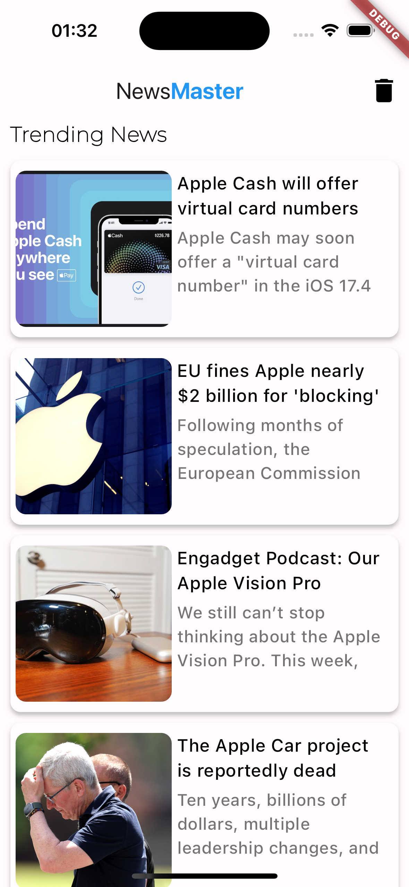

# NewsMaster

A Flutter News application. Only shows Apple news for the moment

Features a Main News List screen and a News Preview screen with a "Open Full Article" opening the article in Webview

  
  
  

Also implements a "star to favorite" feature. Favorited news appear on the main screen, is there are any. clicking "View All" opens the full fav news list. Removing the star off of a news article removes it off of favs list. Clicking the TRASH nav bar button on Main screen clears the Favorite list

  
  

Known problem is: running app in debug mode freezes it because one of the news providers always provides a faulty image or a .webp image and crashes the CachedNetworkImage instance. Running the app normally allows for a freeze-free experience
